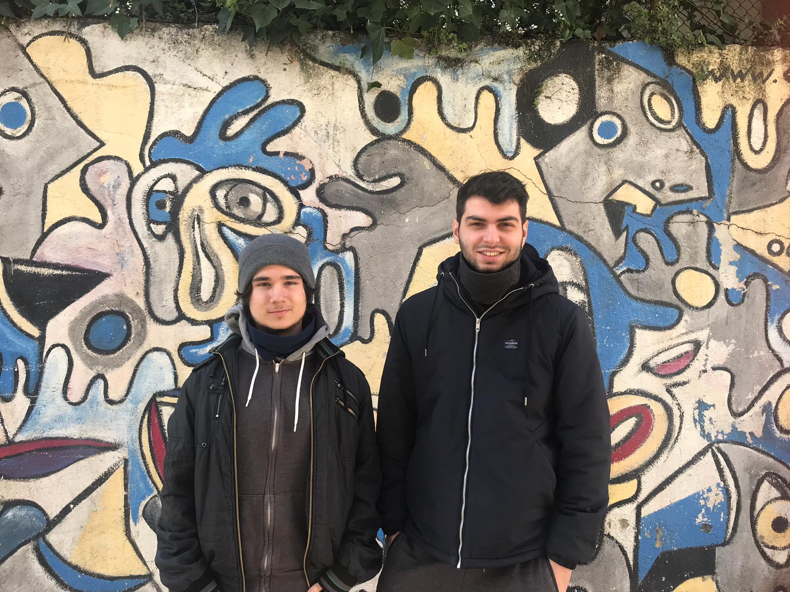

# Ninja Way 2

## Introduction

Welcome to our platformer game!

As students of the second grade in game design in CITM Terrassa, we have made a platformer game for the subject of game development.
Here, you will be a ninja whose goal is to get to the end of the levels passing throught a sort of handicaps and enemies. This can be reach using 2 different skills: shooting a kunai and teleporting yourself.

## Team members

* Right member (Víctor Tirado): Manager, programmer and designer

  View [Github Profile](https://github.com/VictorTirado)

* Left member (Enric Pérez): Artist, programmer and designer

  View [Github Profile](https://github.com/PerezEnric)

## Core subsystems and innovations

First of all we started to make our platformer game by drawing a map with Tiled with its layers and properties and a mechanic like teleport to make the game more interesting. Then we added enemies using A* and the way to kill them (in this case is by shooting a kunai). And finally, we added UI as well as a main menu where the player can choose between two characters, settings were the language and music volume can be changed, and credits. In addition, in the scene we added hearts to represent player's lifes, a book to know if it is caught or not, puntuation and a timer.

## Links

* Link to our github repository [here](https://github.com/VictorTirado/Development-Assigment)

* Link to download the lastest release [here](https://github.com/VictorTirado/Development-Assigment/releases)

## Gameplay
Here you can see a short gameplay!
<iframe width="560" height="315" src="https://www.youtube.com/embed/nCi3O0hDIr8" frameborder="0" allow="accelerometer; autoplay; encrypted-media; gyroscope; picture-in-picture" allowfullscreen></iframe>

## Instructions to play

- A/D to move forwards and backwards
- SPACEBAR to jump
- Left Shift to teleport (only if the player has caught the book that appears in some place around the level)
- Q to shoot the kunai

## License

MIT License

Copyright (c) 2018 [Víctor Tirado Fernández & Enric Pérez Rifà]
Permission is hereby granted, free of charge, to any person obtaining a copy
of this software and associated documentation files (the "Software"), to deal
in the Software without restriction, including without limitation the rights
to use, copy, modify, merge, publish, distribute, sublicense, and/or sell
copies of the Software, and to permit persons to whom the Software is
furnished to do so, subject to the following conditions:

The above copyright notice and this permission notice shall be included in all
copies or substantial portions of the Software.

THE SOFTWARE IS PROVIDED "AS IS", WITHOUT WARRANTY OF ANY KIND, EXPRESS OR
IMPLIED, INCLUDING BUT NOT LIMITED TO THE WARRANTIES OF MERCHANTABILITY,
FITNESS FOR A PARTICULAR PURPOSE AND NONINFRINGEMENT. IN NO EVENT SHALL THE
AUTHORS OR COPYRIGHT HOLDERS BE LIABLE FOR ANY CLAIM, DAMAGES OR OTHER
LIABILITY, WHETHER IN AN ACTION OF CONTRACT, TORT OR OTHERWISE, ARISING FROM,
OUT OF OR IN CONNECTION WITH THE SOFTWARE OR THE USE OR OTHER DEALINGS IN THE
SOFTWARE.

